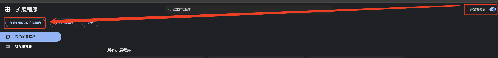

# ro-mvp-spawn-ext

支持 chrome,firefox,edge 请使用对应名称的包

这个 extenssion 会在 momoro discord 的 news-ingame 频道拿数据,判断 mvp 存活状态。

## 使用

安装

1. 加载浏览器拓展程序, 打开 谷歌浏览器 ,设置中找到 拓展程序

2. 打开开发者模式，选择加载已解压的拓展程序

3. 选中拓展包

你可以选择: 拉取公共数据(不保证实时) 以及 自己抓取数据

抓取数据

可以实时获取数据

1. 打开discord
2. 进入momo server 的 news-ingame channel,浏览,往下拉访问以前的数据,程序会帮你抓取mvp击杀数据

拉取数据

可以拉取别人推送的数据，但是不保证实时

1. 点击拉取数据

推送数据

可以推送数据到一块公共存储中，方便别人拉取

1. 先确保你抓取了更新一些的discord数据(如果比公共数据时间落后，那么会上传失败)
2. 点击推送数据
