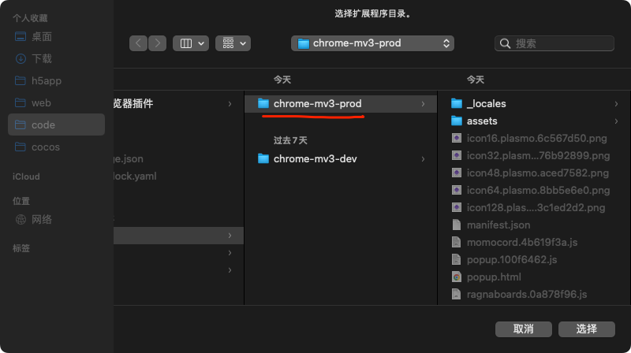

# ro-mvp-spawn-ext

支持 chrome,firefox,edge 请使用对应名称的包

这个 extenssion 会在 momoro discord 的 news-ingame 频道拿数据,判断 mvp 存活状态。

## 使用

安装

1. 加载浏览器拓展程序, 打开 谷歌浏览器 ,设置中找到 拓展程序

2. 打开开发者模式，选择加载已解压的拓展程序

3. 选中拓展包

### 抓取数据

可以实时获取数据

1. 打开discord
2. 进入momo server 的 news-ingame channel,浏览,往下拉访问以前的数据,程序会帮你抓取mvp击杀数据

### 查看地图

打开 https://ragnaboards.net/worldmap/ 查看地图，mvp信息会加载到地图格子上

## TODO LIST

1. 查询/统计 页

- 按(人物id/物品id/mvpid/消息类型)查询 物品获取信息/mvp击杀信息
- 按(物品id/mvpid) 统计击杀信息
- 排名  
